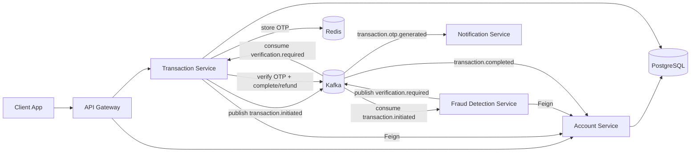

# Banking System Microservices

Distributed banking backend built with Spring Boot and event-driven communication.

This project demonstrates a production-style microservices architecture for account management, money transfers, fraud detection, OTP verification, and notifications.

## Why This Project Is Strong For Resume And GitHub Pin

- Microservices architecture with clear bounded contexts
- Event-driven workflows using Kafka topics
- Synchronous service-to-service calls with OpenFeign
- Stateful services using PostgreSQL and Redis
- Infrastructure orchestration via Docker Compose
- Real-world transaction lifecycle with compensation and fraud handling

## Architecture Overview



## Services

| Service | Responsibility |
|---|---|
| API Gateway | Single entry point and routing |
| Account Service | Account creation, balance, block, debit, credit |
| Transaction Service | Transfer workflow, OTP verification, compensation |
| Fraud Detection Service | Rule-based fraud checks and verification requests |
| Notification Service | Consumes events and sends user alerts |

## Tech Stack

- Java 25
- Spring Boot 4
- Spring Data JPA
- Spring Cloud OpenFeign
- Spring for Apache Kafka
- Spring Data Redis
- PostgreSQL
- Redis
- Docker Compose
- Maven Wrapper

## Event-Driven Flow

1. Transaction Service receives transfer request.
2. Sender account is debited through Account Service (Feign).
3. Transaction Service publishes transaction.initiated.
4. Fraud Detection Service consumes and evaluates risk.
5. If suspicious, verification.required is published.
6. Transaction Service generates OTP and stores it in Redis with TTL.
7. User verifies OTP.
8. Transaction is completed or compensated/refunded depending on result.

## API Highlights

### Account Service

- POST /api/v1/accounts
- GET /api/v1/accounts/{accountNumber}
- GET /api/v1/accounts/{accountNumber}/balance
- PUT /api/v1/accounts/{accountNumber}/deduct
- PUT /api/v1/accounts/{accountNumber}/credit
- PUT /api/v1/accounts/{accountNumber}/block

### Transaction Service

- POST /api/v1/transactions/transfer
- GET /api/v1/transactions/{transactionId}
- GET /api/v1/transactions/account/{accountNumber}
- POST /api/v1/transactions/{transactionId}/verify

## Local Development

### 1) Start infrastructure

Run at repository root:

```bash
docker compose up -d
```

This starts:

- PostgreSQL on 5432
- Redis on 6379
- Zookeeper on 2181
- Kafka on 9092

### 2) Run services

In each module folder, run:

```bash
./mvnw spring-boot:run
```

Suggested order:

1. account-service
2. transaction-service
3. fraud-detection-service
4. notification-service
5. api-gateway

## Repository Structure

```text
account-service/
api-gateway/
fraud-detection-service/
notification-service/
payment-service/
transaction-service/
docker-compose.yml
```

## What To Highlight In Resume

- Designed and implemented an event-driven microservices banking backend.
- Built transaction safety workflow with OTP verification and compensation.
- Integrated synchronous and asynchronous communication (OpenFeign + Kafka).
- Applied Redis for short-lived security data (OTP TTL).
- Containerized local infrastructure with Docker Compose for consistent setup.

## Current Status

Active development. Core transfer, fraud, and account flows are implemented and can be expanded with stronger observability, tests, and deployment automation.
